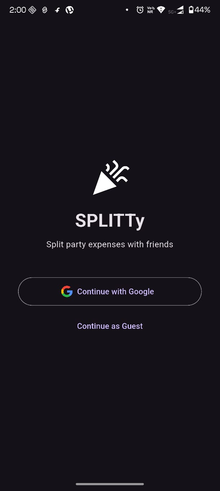
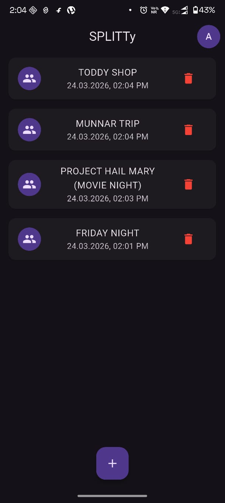
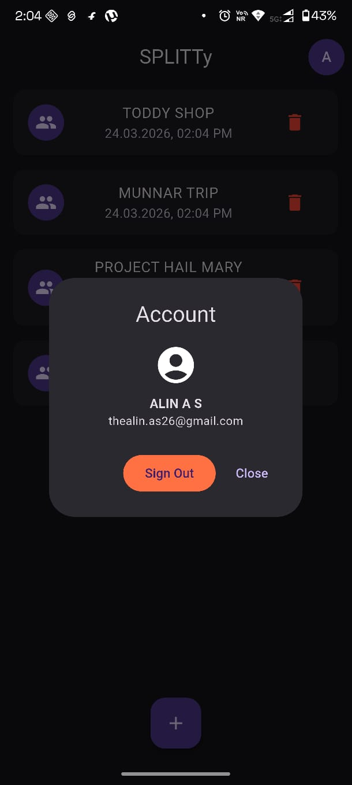
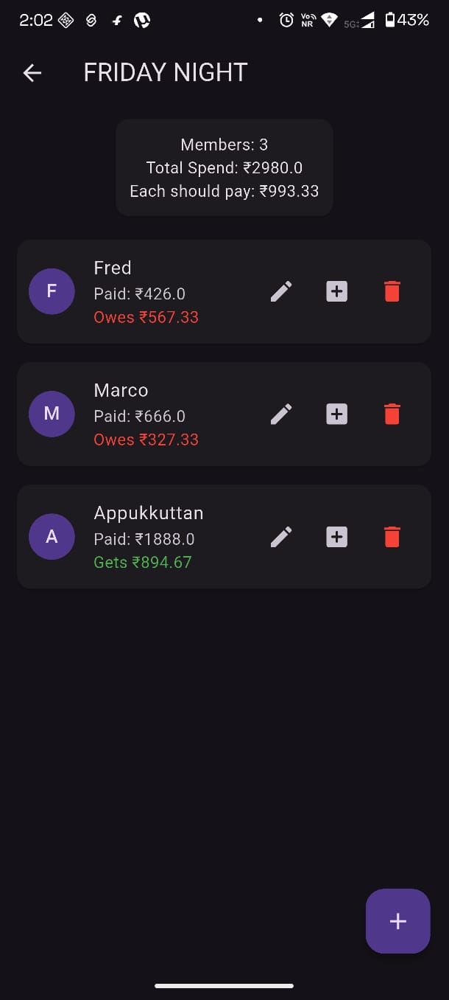
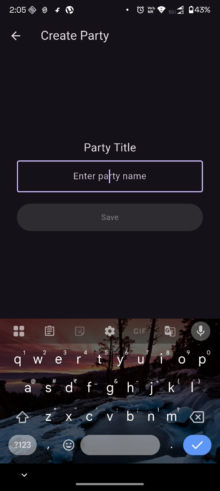

# 🎉 SPLITTy – Party Expense Splitter

📥 **Download APK**

You can download and install the Android app directly:

⬇ **Download SPLITTy APK**

https://drive.google.com/file/d/1Q_tEAFX4Z-DSKoVUdPXwCyHhmu6m6N2a/view?usp=drive_link

---

SPLITTy is a **Flutter expense splitting app** that helps friends easily track and divide shared expenses during parties, trips, or group events.

The app calculates how much each member paid and automatically determines **who owes money and who should receive money**.

---

# 📱 App Screenshots

<p align="center">





</p>

---

# ✨ Features

* 🎉 Create party/events
* 👥 Add multiple members
* 💰 Track how much each member paid
* 📊 Automatic equal expense calculation
* 📉 Shows who **owes** and who **gets money**
* ✏️ Edit or add payments
* ❌ Delete members or parties
* 🔐 Google Sign-In authentication
* 👤 Guest login support
* ☁️ Cloud storage with Firebase Firestore

---

# 🔐 Authentication

SPLITTy supports two login methods:

* **Google Sign-In**
* **Guest Login**

Users can quickly start using the app without creating an account.

---

# ☁️ Firebase Database Structure

```
users
 └── userId
      └── parties
           └── partyId
                ├── title
                ├── createdAt
                └── members[]
```

Each member contains:

```
name
amountPaid
```

---

# 🧠 Expense Calculation Example

```
Total Spend: ₹1200
Members: 3
Each Should Pay: ₹400
```

Result:

```
Rahul  → Gets ₹200
Arjun  → Owes ₹100
Maya   → Owes ₹100
```

---

# 🛠 Tech Stack

* Flutter
* Dart
* Firebase Authentication
* Google Sign-In
* Cloud Firestore
* Material UI

---

# 📂 Project Structure

```
lib
 ├── models
 │   ├── member.dart
 │   └── party.dart
 │
 ├── services
 │   ├── auth_service.dart
 │   └── firestore_service.dart
 │
 ├── screens
 │   ├── login_screen.dart
 │   ├── home_screen.dart
 │   ├── create_party_screen.dart
 │   └── party_details_screen.dart
 │
 └── main.dart
```

---

# 🚀 Installation

Clone the repository

```
git clone https://github.com/alin262/Party-Split
```

Install dependencies

```
flutter pub get
```

Run the app

```
flutter run
```

---

# 📦 Build Release

Build APK

```
flutter build apk --release
```

Build Play Store bundle

```
flutter build appbundle
```

---

# ⚠️ Firebase Configuration

The Firebase API key included in this project is **restricted to this application only**.

To run this project with your own Firebase backend:

1. Create a Firebase project
2. Add an Android app
3. Download `google-services.json`
4. Place it in

   android/app/google-services.json

---

# 👨‍💻 Author

**Alin A S**

BCA Student – IGNOU

GitHub
https://github.com/alin262

LinkedIn
https://www.linkedin.com/in/alinjoseph

---

# ⭐ Support

If you like this project, consider giving it a **⭐ on GitHub**.
